<p align="center"></p>

<p align="center"><sub>10-second tour: Ask → Route → Retrieve → Reason → Reply</sub></p>

<p align="center">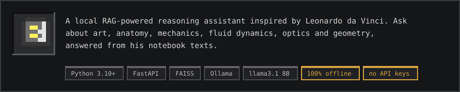</p>

<p align="center"></p>

<a id="features"></a>
<h2></h2>

<p align="center">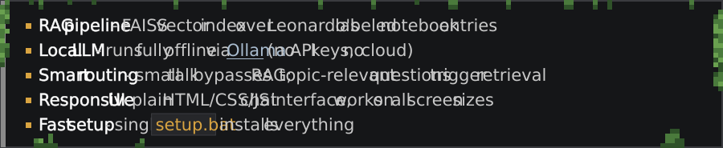</p>

<p align="center"><a href="https://ollama.com"></a></p>

<a id="prerequisites"></a>
<h2></h2>

<p align="center">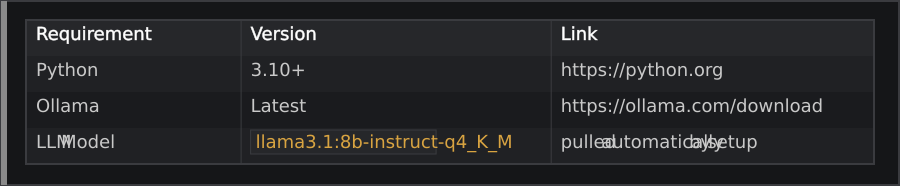</p>

<a id="quick-start"></a>
<h2></h2>

<p align="center">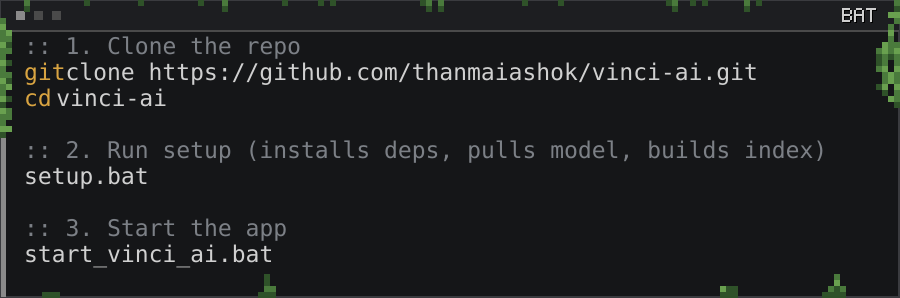</p>

<details>
<summary>Copy as text</summary>

```bat
:: 1. Clone the repo
git clone https://github.com/thanmaiashok/vinci-ai.git
cd vinci-ai

:: 2. Run setup (installs deps, pulls model, builds index)
setup.bat

:: 3. Start the app
start_vinci_ai.bat
```

</details>

<p align="center"></p>

<a id="project-structure"></a>
<h2></h2>

<p align="center">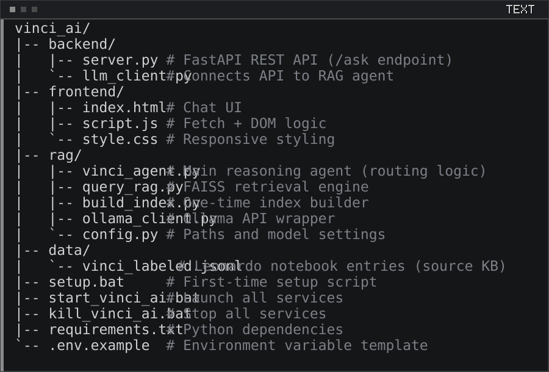</p>

<details>
<summary>Copy as text</summary>

```
vinci_ai/
├── backend/
│   ├── server.py          # FastAPI REST API (/ask endpoint)
│   └── llm_client.py      # Connects API to RAG agent
├── frontend/
│   ├── index.html         # Chat UI
│   ├── script.js          # Fetch + DOM logic
│   └── style.css          # Responsive styling
├── rag/
│   ├── vinci_agent.py     # Main reasoning agent (routing logic)
│   ├── query_rag.py       # FAISS retrieval engine
│   ├── build_index.py     # One-time index builder
│   ├── ollama_client.py   # Ollama API wrapper
│   └── config.py          # Paths and model settings
├── data/
│   └── vinci_labeled.jsonl  # Leonardo notebook entries (source KB)
├── setup.bat              # First-time setup script
├── start_vinci_ai.bat     # Launch all services
├── kill_vinci_ai.bat      # Stop all services
├── requirements.txt       # Python dependencies
└── .env.example           # Environment variable template
```

</details>

<p align="center">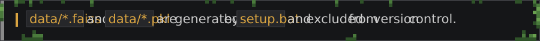</p>

<a id="how-it-works"></a>
<h2></h2>

<p align="center">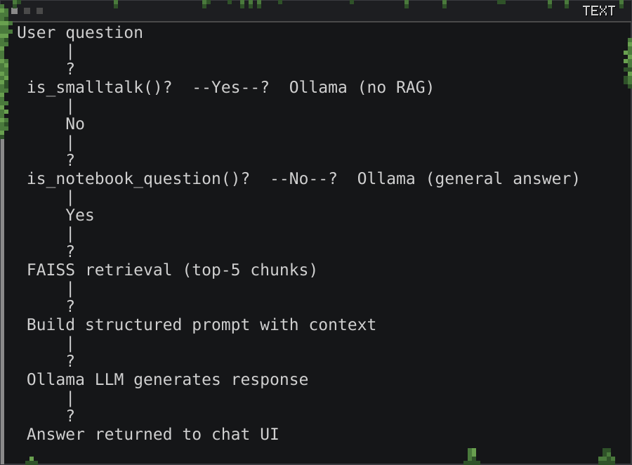</p>

<details>
<summary>Copy as text</summary>

```
User question
     │
     ▼
 is_smalltalk()?  ──Yes──▶  Ollama (no RAG)
     │
     No
     │
     ▼
 is_notebook_question()?  ──No──▶  Ollama (general answer)
     │
     Yes
     │
     ▼
 FAISS retrieval (top-5 chunks)
     │
     ▼
 Build structured prompt with context
     │
     ▼
 Ollama LLM generates response
     │
     ▼
 Answer returned to chat UI
```

</details>

<a id="rebuilding-the-index"></a>
<h2></h2>

<p align="center">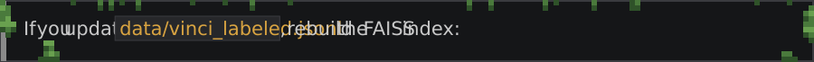</p>

<p align="center">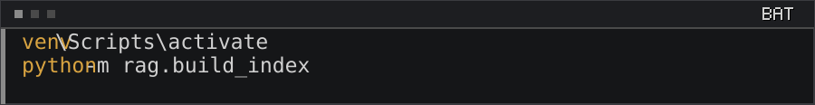</p>

<details>
<summary>Copy as text</summary>

```bat
venv\Scripts\activate
python -m rag.build_index
```

</details>

<a id="tech-stack"></a>
<h2></h2>

<p align="center">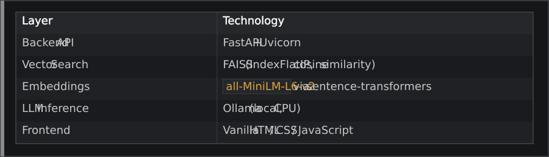</p>

<a id="license"></a>
<h2></h2>

<p align="center"></p>

<p align="center"><a href="LICENSE"></a></p>

<p align="center"><a href="https://github.com/thanmaiashok"></a></p>
